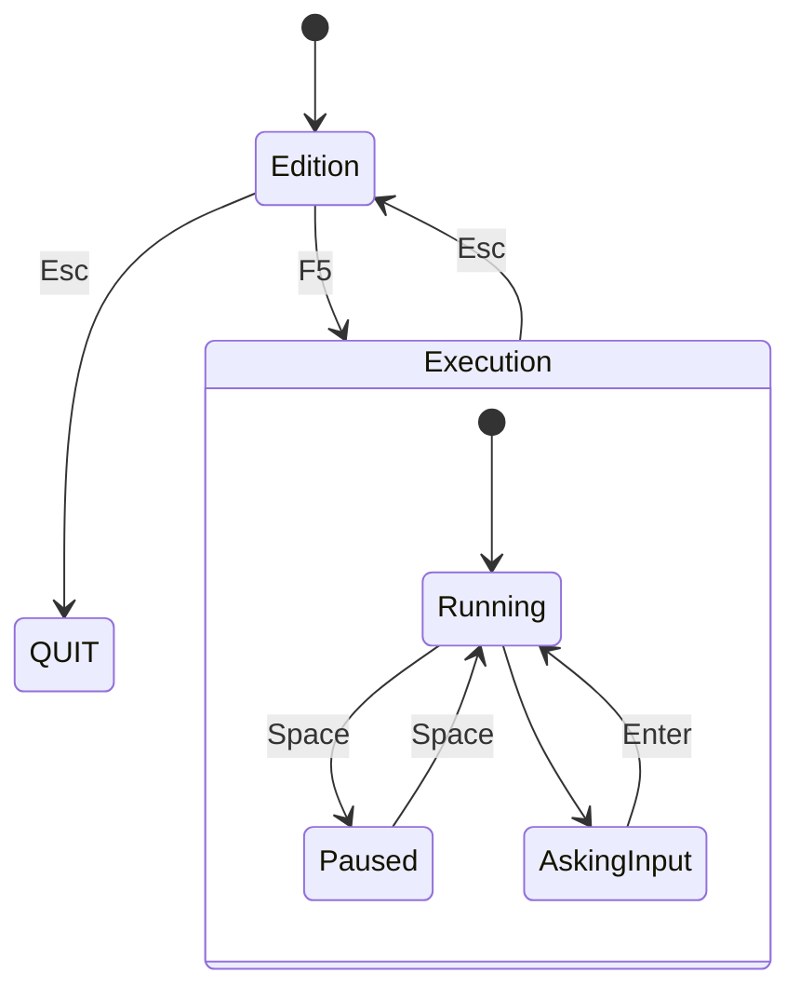
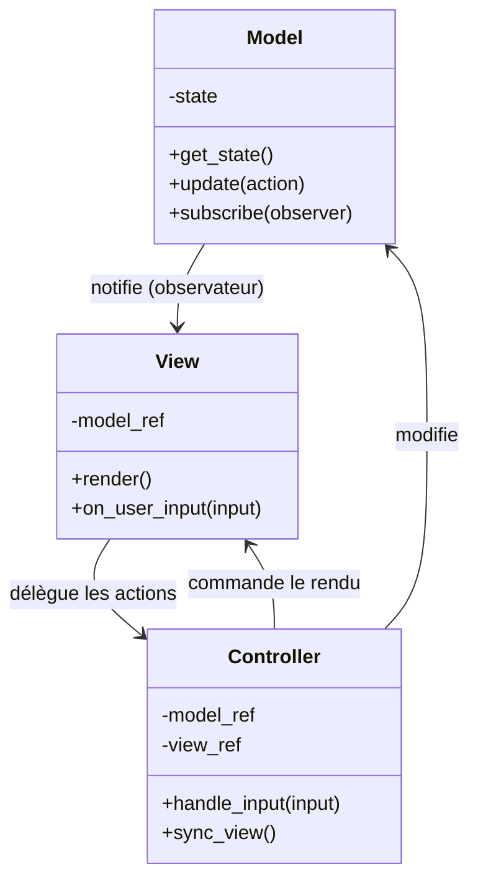

```mermaid
stateDiagram-v2
    [*] --> Edition

    Edition --> Execution : F5

    state Execution {
        [*] --> Running
        Running --> Paused : Space
        Paused --> Running : Space

        Running --> AskingInput
        AskingInput --> Running : Enter
    }

    Execution --> Edition : Esc
    Edition --> QUIT : Esc
```

```mermaid
classDiagram
    class Direction {
        North
        South
    }
    class Point {
        +f64 x
        +f64 y
    }
    class Drawable {
        +draw() void
    }
    Point ..|> Drawable

    cssClass "Direction" enumStyle
    cssClass "Point" structStyle
    cssClass "Drawable" traitStyle

    classDef enumStyle fill:#f9e79f
    classDef structStyle fill:#aed6f1
    classDef traitStyle fill:#000000
```

```mermaid
classDiagram
    class Model {
        -state
        +get_state()
        +update(action)
        +subscribe(observer)
    }

    class View {
        -model_ref
        +render()
        +on_user_input(input)
    }

    class Controller {
        -model_ref
        -view_ref
        +handle_input(input)
        +sync_view()
    }

    Controller --> Model : modifie
    Controller --> View : commande le rendu
    View --> Controller : délègue les actions
    Model --> View : notifie (observateur)
```
