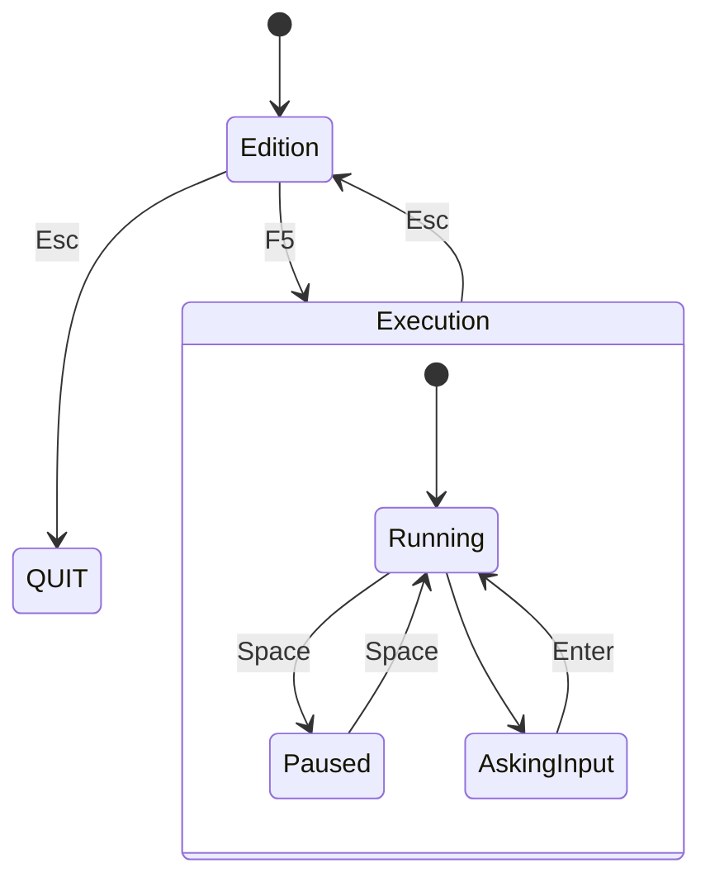
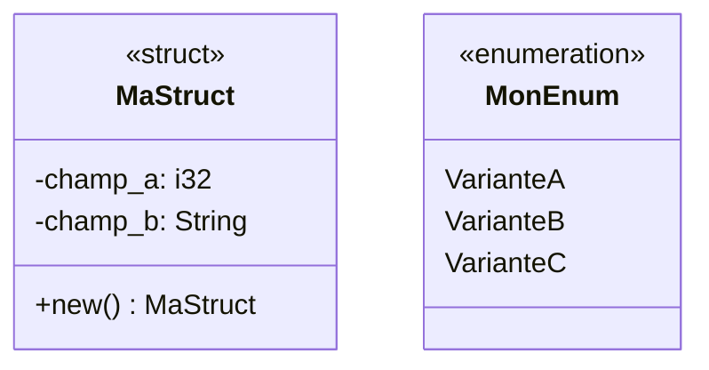
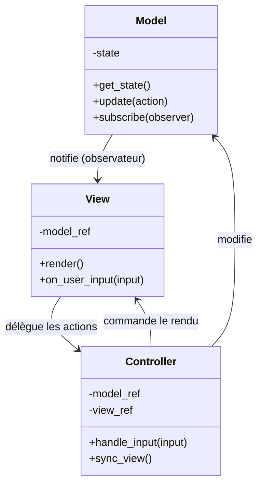

```mermaid
stateDiagram-v2
    [*] --> Edition

    Edition --> Execution : F5

    state Execution {
        [*] --> Running
        Running --> Paused : Space
        Paused --> Running : Space

        Running --> AskingInput
        AskingInput --> Running : Enter
    }

    Execution --> Edition : Esc
    Edition --> QUIT : Esc
```

```mermaid
classDiagram
    class MaStruct {
        <<struct>>
        -champ_a: i32
        -champ_b: String
        +new() MaStruct
    }

    class MonEnum {
        <<enumeration>>
        VarianteA
        VarianteB
        VarianteC
    }


```

```mermaid
classDiagram
    class Model {
        -state
        +get_state()
        +update(action)
        +subscribe(observer)
    }

    class View {
        -model_ref
        +render()
        +on_user_input(input)
    }

    class Controller {
        -model_ref
        -view_ref
        +handle_input(input)
        +sync_view()
    }

    Controller --> Model : modifie
    Controller --> View : commande le rendu
    View --> Controller : délègue les actions
    Model --> View : notifie (observateur)
```
