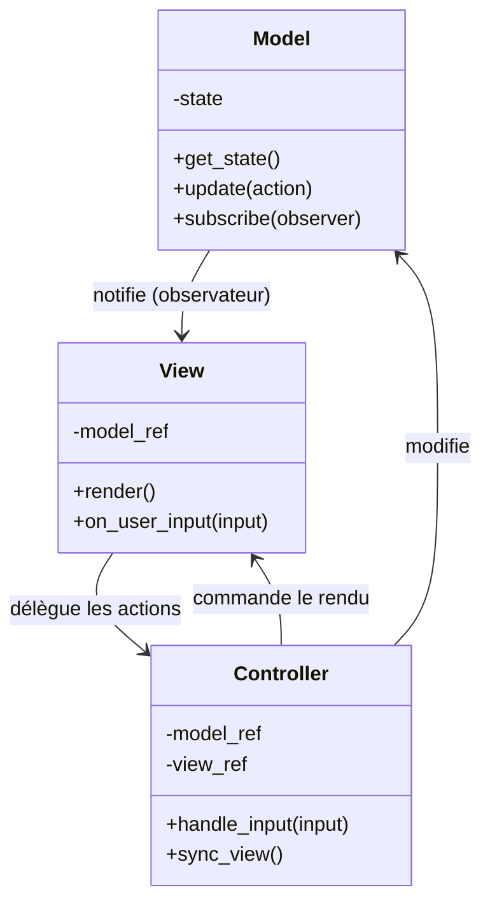

```mermaid
classDiagram
    class Model {
        -state
        +get_state()
        +update(action)
        +subscribe(observer)
    }

    class View {
        -model_ref
        +render()
        +on_user_input(input)
    }

    class Controller {
        -model_ref
        -view_ref
        +handle_input(input)
        +sync_view()
    }

    Controller --> Model : modifie
    Controller --> View : commande le rendu
    View --> Controller : délègue les actions
    Model --> View : notifie (observateur)
```
