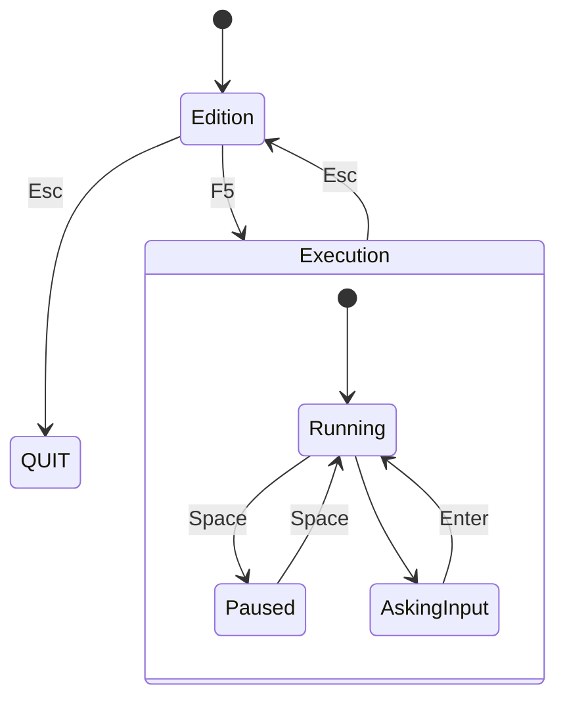
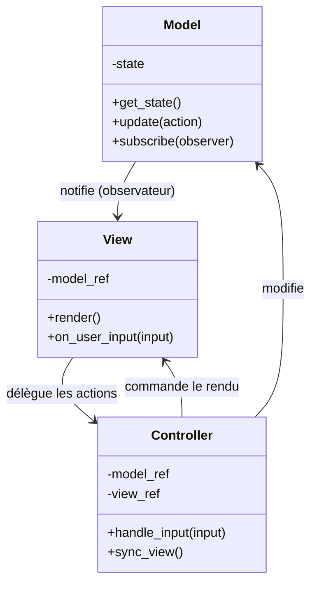
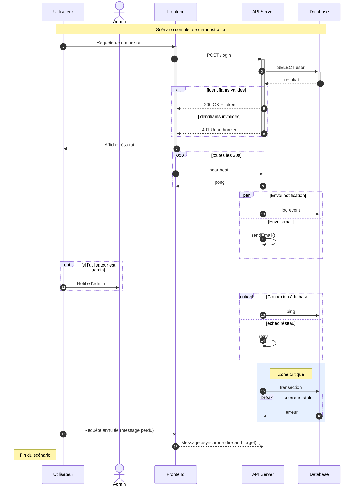

```mermaid
stateDiagram-v2
    [*] --> Edition

    Edition --> Execution : F5

    state Execution {
        [*] --> Running
        Running --> Paused : Space
        Paused --> Running : Space

        Running --> AskingInput
        AskingInput --> Running : Enter
    }

    Execution --> Edition : Esc
    Edition --> QUIT : Esc
```

```mermaid
classDiagram
    class Direction {
        North
        South
    }
    class Point {
        +f64 x
        +f64 y
    }
    class Drawable {
        +draw() void
    }
    Point ..|> Drawable

    cssClass "Direction" enumStyle
    cssClass "Point" structStyle
    cssClass "Drawable" traitStyle

    classDef enumStyle fill:#f9e79f
    classDef structStyle fill:#aed6f1
    classDef traitStyle fill:#000000
```

```mermaid
classDiagram
    class Model {
        -state
        +get_state()
        +update(action)
        +subscribe(observer)
    }

    class View {
        -model_ref
        +render()
        +on_user_input(input)
    }

    class Controller {
        -model_ref
        -view_ref
        +handle_input(input)
        +sync_view()
    }

    Controller --> Model : modifie
    Controller --> View : commande le rendu
    View --> Controller : délègue les actions
    Model --> View : notifie (observateur)
```

```mermaid

sequenceDiagram
    autonumber

    participant U as Utilisateur
    actor A as Admin
    participant F as Frontend
    participant API as API Server
    participant DB as Database

    Note over U,DB: Scénario complet de démonstration

    U->>F: Requête de connexion
    activate F
    F->>+API: POST /login
    API->>+DB: SELECT user
    DB-->>-API: résultat
    alt identifiants valides
        API-->>F: 200 OK + token
    else identifiants invalides
        API-->>F: 401 Unauthorized
    end
    deactivate API
    F-->>-U: Affiche résultat

    loop toutes les 30s
        F->>API: heartbeat
        API-->>F: pong
    end

    par Envoi notification
        API->>DB: log event
    and Envoi email
        API->>API: sendEmail()
    end

    opt si l'utilisateur est admin
        U->>A: Notifie l'admin
    end

    critical Connexion à la base
        API->>DB: ping
    option échec réseau
        API->>API: retry
    end

    rect rgb(230, 240, 255)
        Note right of API: Zone critique
        API->>DB: transaction
        break si erreur fatale
            DB-->>API: erreur
        end
    end

    U-xF: Requête annulée (message perdu)
    F--)API: Message asynchrone (fire-and-forget)

    Note left of U: Fin du scénario
```
